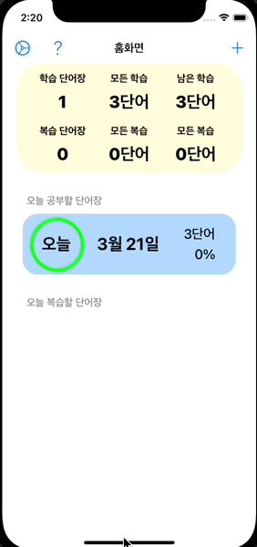
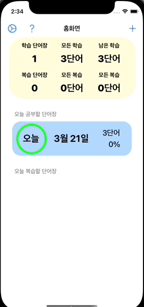
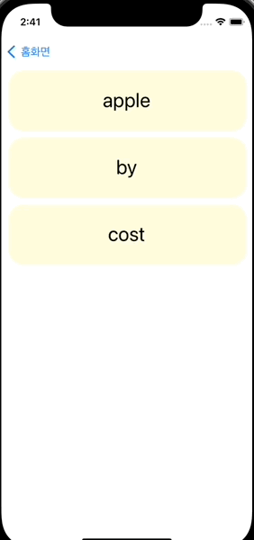
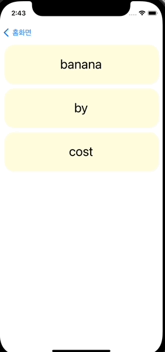
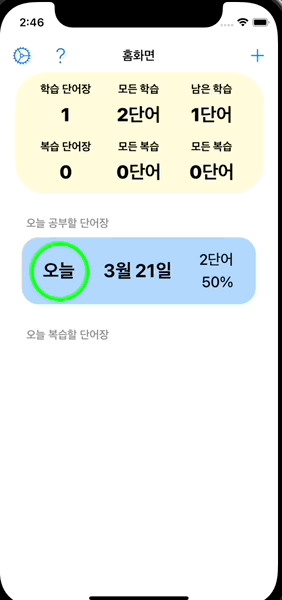

# Auto Voca Schedule (오! 보스) 프로젝트 📖

단어장 앱을 앱스토어 출시하는 개인 프로젝트입니다. 

스스로 서비스를 처음부터 끝까지 만들어 보고 직접 운영까지 해보기 위해서 시작한 프로젝트입니다. 💪

2022년 1월 25일 시작하여 현재 진행 중입니다. 🏃

# 핵심 기능 설계 ⚙️

1. 직접 단어 추가 기능 ➕
    - 오늘 날짜의 단어장에 단어와 뜻을 추가할 수 있는 기능입니다.
    - 단어의 뜻을 별도의 Schema로 저장할 수 있도록 구현했습니다.
2. 복습 스케줄링 🗓
    - 에빙하우스 망각곡선 이론을 바탕으로 복습 일정을 자동으로 짜주는 기능입니다.
    - 하루 분량의 단어장을 하나의 단어장을 3일간 학습합니다.
    - 3일간 학습한 이후 3일, 7일, 14일 간격으로 복습합니다.
    - 복습 중에 테스트를 통과하지 못한 단어는 오늘 단어장으로 옮겨서 처음부터 다시 학습하도록 합니다.
3. 학습 및 테스트 기능 📝
    - 학습 페이지를 통해서 스펠링/뜻을 번갈아 보며 단어를 학습할 수 있습니다.
    - 테스트 페이지를 통해서 단어를 테스트하고 결과를 중간에 저장할 수 있습니다.
    - 테스트에 통과하지 못하는 단어만 필터링해서 학습/테스트할 수 있습니다.
4. 단어 리스트 랜덤 기능 💫
    - 종이 단어장으로 학습을 하면 단어의 위치와 주변 단어가 힌트가 되어 학습 및 테스트에 방해가 되는 경우가 있습니다.
    - 따라서 학습 및 테스트 시 단어 리스트를 랜덤으로 섞을 수 있는 기능을 구현하였습니다.
5. 알람 기능 (추후 업데이트 예정) ⏰
    - 복습 시간을 미리 정해놓으면 복습할 단어장과 단어 갯수를 포함한 알람을 제공하는 기능입니다.
    - 특정 공간에 도착하면 위와 동일한 알람을 제공하는 기능입니다.

# 사용 기술 💻
- Swift
- Code-based UI (UIKit)
- MVVM, Singleton, Delegate
- Core Data
- [SideMenu](https://github.com/jonkykong/SideMenu)
- Xcode, iOS simulator

# 앱 시연 갤러리 📷

## 홈 화면 기능

### 단어 추가 기능
직접 단어를 입력하여 추가할 수 있습니다. 뜻은 최대 3개까지 추가 가능합니다.

### 설정 기능
학습 혹은 테스트 시 단어의 순서와 테스트를 통과할 단어를 포함 여부를 설정할 수 있습니다.

## 단어 학습 및 테스트 기능

### 단어 학습 기능
스펠링 뜻을 번갈아서 보면서 단어를 학습할 수 있습니다.

### 단어 테스트 기능
테스트 통과 여부를 체크해가면서 단어를 테스트할 수 있습니다.
.

## 단어 수정 및 삭제 기능

### 단어 수정 기능
단어의 스펠링과 뜻을 모두 수정할 수 있습니다.

### 단어 삭제 기능
저장한 단어를 삭제할 수 있습니다.

## 튜토리얼
단어장의 사용 방식을 설명하는 페이지를 제공합니다.

# 문제해결 아카이브 🤔
