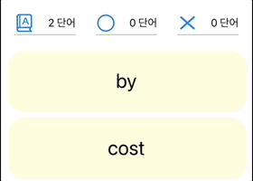
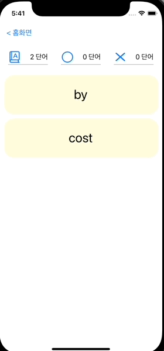
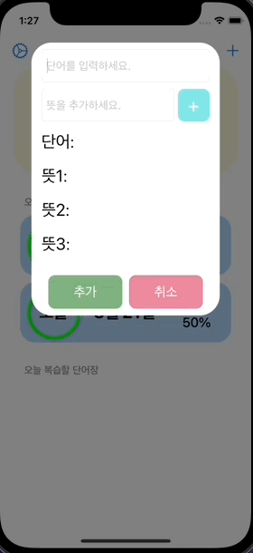
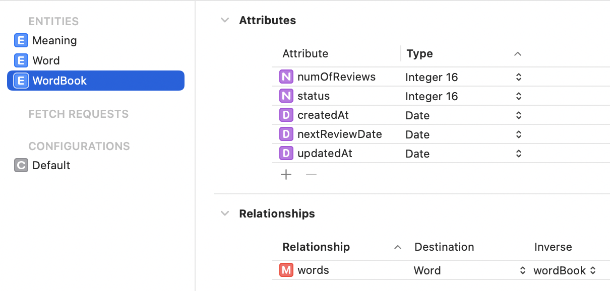
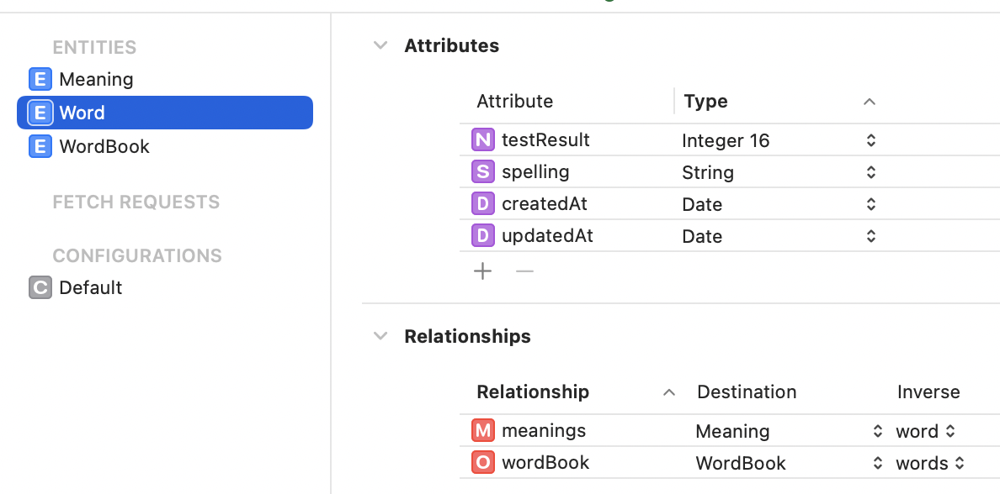
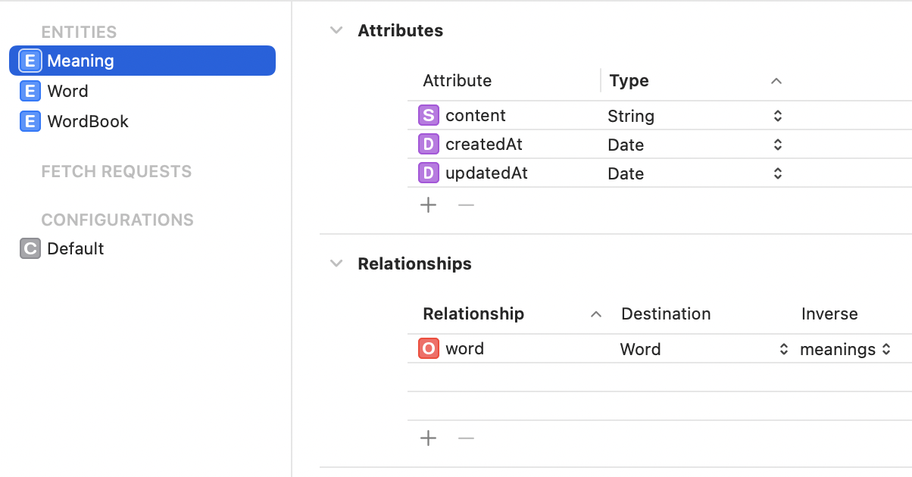
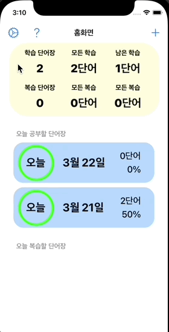
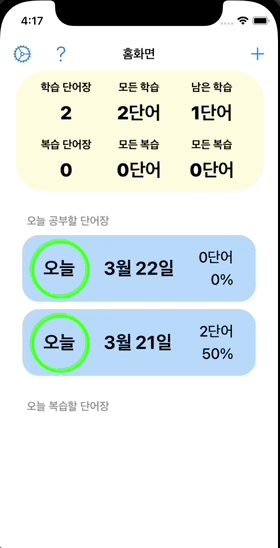

# Auto Voca Scheduler 프로젝트 📖

단어장 앱을 앱스토어 출시하는 개인 프로젝트입니다. 

스스로 서비스를 처음부터 끝까지 만들어 보고 직접 운영까지 해보기 위해서 시작한 프로젝트입니다. 💪

[앱스토어 링크](https://apps.apple.com/kr/app/%EC%8A%A4%EC%BC%80%EC%A4%84-%EB%8B%A8%EC%96%B4%EC%9E%A5/id1617214875)

# 핵심 기능 설계 ⚙️

1. 직접 단어 추가 기능 ➕
    - 오늘 날짜의 단어장에 단어와 뜻을 추가할 수 있는 기능입니다.
    - 단어의 뜻을 별도의 Schema로 저장할 수 있도록 구현했습니다.
2. 복습 스케줄링 🗓
    - 에빙하우스 망각곡선 이론을 바탕으로 복습 일정을 자동으로 짜주는 기능입니다.
    - 하루 분량의 단어장을 하나의 단어장을 3일간 학습합니다.
    - 3일간 학습한 이후 3일, 7일, 14일 간격으로 복습합니다.
    - 복습 중에 테스트를 통과하지 못한 단어는 오늘 단어장으로 옮겨서 처음부터 다시 학습하도록 합니다.
3. 학습 및 테스트 기능 📝
    - 학습 페이지를 통해서 스펠링/뜻을 번갈아 보며 단어를 학습할 수 있습니다.
    - 테스트 페이지를 통해서 단어를 테스트하고 결과를 중간에 저장할 수 있습니다.
    - 테스트에 통과하지 못하는 단어만 필터링해서 학습/테스트할 수 있습니다.
4. 단어 리스트 랜덤 기능 💫
    - 종이 단어장으로 학습을 하면 단어의 위치와 주변 단어가 힌트가 되어 학습 및 테스트에 방해가 되는 경우가 있습니다.
    - 따라서 학습 및 테스트 시 단어 리스트를 랜덤으로 섞을 수 있는 기능을 구현하였습니다.
5. 알람 기능 (To be updated) ⏰
    - 복습 시간을 미리 정해놓으면 복습할 단어장과 단어 갯수를 포함한 알람을 제공하는 기능입니다.
    - 특정 공간에 도착하면 위와 동일한 알람을 제공하는 기능입니다.

# 회고 📜
- 잘한 점
    1. 익숙한 Sqlite와 처음 배워야 하는 Core Data 사이에서 Core Data를 선택했습니다. 뭐든지 배우면서 할 수 있다는 자신감을 깨달았습니다.
    2. 최대한 작은 task로 나누어서 개발하려고 노력했습니다. 문제를 체계적으로 파악하기 쉬웠으며 성취감도 자주 맛볼 수 있었습니다.
    3. 개인 프로젝트였지만 협업한다고 생각하고 API를 만들었습니다. MVVM, 캡슐화, 모듈화를 지켜 클린코딩을 하고자 노력했습니다.
- 아쉬운 점
    1. 전반적으로 스케줄에 쫒겼습니다. 목표한 구현 스케줄보다 늦어지기도 했고 일부 기능이나 코드 퀄리티를 포기해야하는 경우도 있었습니다.
    2. 에러 처리를 완벽하게 하지 못했습니다.
    3. 계획했던 알람 기능을 구현하지 못하고 출시했습니다.
- 배운 점
    1. 개발 스케줄을 짜고 지키는 것도 개발자의 중요한 능력이라는 것을 배웠습니다. 일정과 코드 퀄리티 사이의 갈등을 실제로 경험하고 둘 중에 어느 쪽을 선택해야하는지 고민하는 시간을 가졌습니다.
    2. 상용 앱의 기획부터 출시까지 경험할 수 있었습니다.
    3. 앱을 출시한 이후에도 지속적인 업데이트를 통해 개선하고자하는 의지가 생겼습니다.

# 사용 기술 💻
- Swift
- Code-based UI (UIKit)
- MVVM, Singleton, Delegate
- Core Data
- [SideMenu](https://github.com/jonkykong/SideMenu)
- Xcode, iOS simulator

# 앱 시연 갤러리 📷

## 홈 화면 기능

### 단어 추가 기능
직접 단어를 입력하여 추가할 수 있습니다. 뜻은 최대 3개까지 추가 가능합니다.


### 설정 기능
학습 혹은 테스트 시 단어의 순서와 테스트를 통과할 단어를 포함 여부를 설정할 수 있습니다.


## 단어 학습 및 테스트 기능

### 단어 학습 기능
스펠링 뜻을 번갈아서 보면서 단어를 학습할 수 있습니다.


### 단어 테스트 기능
테스트 통과 여부를 체크해가면서 단어를 테스트할 수 있습니다.


## 단어 수정 및 삭제 기능

### 단어 수정 기능
단어의 스펠링과 뜻을 모두 수정할 수 있습니다.


### 단어 삭제 기능
저장한 단어를 삭제할 수 있습니다.


## 튜토리얼
단어장의 사용 방식을 설명하는 페이지를 제공합니다.


# Trouble Shooting 아카이브 🤔

## 단어 Cell 뒤집어서 스펠링 <-> 뜻 전환하기
### Trouble
영어 단어 학습을 위해서는 스펠링과 뜻을 구분해서 보여주어야 합니다.   
UITableView로 구현한 단어 리스트에서 해당 기능을 구현하기 위해서는 같은 Cell에서 터치할 때마다 스펠링과 뜻을 번갈아 보여주어야 했습니다.  
또한 스펠링과 단어가 바뀐다는 사실을 사용자에게 전달하기 위해서 Cell이 Flip되는 애니메이션이 필요했습니다.

### Shooting
1. 먼저 각 단어의 UITableViewCell에 열거형 WordListCellDisplayMode 타입의 property를 가지도록 하고 property에 따라서 보여지는 Label의 text가 바뀌도록 했습니다.
```swift
enum WordListCellDisplayMode {
    case spelling, meaning
}
```
```swift
var displayMode: WordListCellDisplayMode = .spelling {
    didSet {
        configure()
    }
}

func configure() {
    if displayMode == .spelling {
        wordLabel.font = UIFont.systemFont(ofSize: 30)
        wordLabel.text = viewModel?.wordLabelText
    } else {
        wordLabel.font = UIFont.systemFont(ofSize: viewModel?.meaningFontSize ?? 10)
        wordLabel.text = viewModel?.meaningLabelText
}
```
2. UITableViewDelegate를 통해서 Cell이 탭이 될 때 구현할 메소드를 정의합니다. 먼저 indexPath로 탭이 된 cell 객체를 구하고 해당 객체를 flip하는 animation을 1초간 실행합니다. 그리고 애니메이션 실행 0.5초 후에 cell의 DisplayMode를 토글해서 회전이 중간쯤 되었을 때 스펠링과 뜻이 전환도록 했습니다.
```swift
// MARK: UITableViewDelegate
extension StudyListController: UITableViewDelegate {
    func tableView(_ tableView: UITableView, didSelectRowAt indexPath: IndexPath) {
        // indexPath로 cell 객체 구하기
        guard let cell = tableView.visibleCells.filter({ cell in
            let listCell = cell as! StudyListCell
            let word = listCell.viewModel!.word
            return word.id == self.viewModel.displayingWords[indexPath.row].id
        }).first as? StudyListCell else { return }
        // cell 뒤집기 애니메이션
        UIView.transition(with: cell,
                    duration: 1,
                    options: .transitionFlipFromLeft,
                    animations: { return },
                    completion: nil)
        // cell 반 정도 돌아갔을 때 뜻으로 바꾸기
        DispatchQueue.main.asyncAfter(deadline: .now() + 0.5) {
            cell.toggleDisplayMode()
       }
    }
}
```
### Result


## UITableViewCell 스와이프로 O/X 구현하기 
### Trouble
UITableView로 구현한 단어 리스트에서 스와이프 동작을 통해 단어 테스트 기능을 구현하고자 했습니다.
기존의 스와이프 동작을 수정하고 스와이프 시 나오는 이미지를 변경해야했습니다.

### Shooting
1. leading swipe action (왼쪽에서 오른쪽으로 스와이프)를 정의하는 메소드에 아이콘 크기, 아이콘 랜더링, 아이콘 위치 등을  커스텀한 스와이프 액션을 정의했습니다. 해당 swipe action을 통해서 cell의 단어를 테스트 통과 처리되도록 했습니다.
```swift
func tableView(_ tableView: UITableView, leadingSwipeActionsConfigurationForRowAt indexPath: IndexPath) -> UISwipeActionsConfiguration? {
        let word = viewModel.displayingWords[indexPath.row]
        
        // 스와이프 되었을 때 실행할 동작
        let action = UIContextualAction(style: .normal, title: nil) { _, _, completionHandler in
            self.viewModel.moveWordToSuccess(success: word)
            tableView.deleteRows(at: [indexPath], with: .fade)
            self.configureScoreBoard()
            self.configureUndoButton()
            if self.viewModel.canFinish {
                self.showFinishAlert()
            }
            completionHandler(true)
        }
        
        // 스와이프할 때 나오는 아이콘 배경 수정
        action.backgroundColor = .white
        
        // 이미지 크기를 위한 cell 크기 재기
        let imageSize = tableView.visibleCells.first?.bounds.height ?? 50

        // 그냥 image만 넣으면 흰색으로 자동으로 랜더링 되므로 파란색으로 변경하고 랜더링 모드 alwaysOriginal로 한다.
        // UIGraphicsImageRenderer를 통해서 가로세로 길이 정의하고 frame 위치 조정해서 이미지가 가운데 보이도록 한다.
        
        action.image = UIGraphicsImageRenderer(size: CGSize(width: imageSize, height: imageSize)).image { _ in
            UIImage(systemName: "circle")!
                .withTintColor(.blue, renderingMode: .alwaysOriginal)
                .draw(in: CGRect(x: 7, y: 0, width: imageSize, height: imageSize))
        }
        return UISwipeActionsConfiguration(actions: [action])
    }
```
2. 마찬가지로 trailing swipe action (오른쪽에서 왼쪽으로 스와이프)를 정의하는 메소드를 커스텀했습니다. 해당 swipe action을 통해서 cell의 단어가 테스트 미통과 처리되도록 했습니다.
```swift
func tableView(_ tableView: UITableView, trailingSwipeActionsConfigurationForRowAt indexPath: IndexPath) -> UISwipeActionsConfiguration? {
    let word = viewModel.displayingWords[indexPath.row]

    let action = UIContextualAction(style: .normal, title: nil) { _, view, completionHandler in
        self.viewModel.moveWordToFail(fail: word)
        tableView.deleteRows(at: [indexPath], with: .fade)
        self.configureScoreBoard()
        self.configureUndoButton()
        if self.viewModel.canFinish {
            self.showFinishAlert()
        }
        completionHandler(true)
    }
    
    let imageSize = tableView.visibleCells.first?.bounds.height ?? 50
    action.backgroundColor = .white
    action.image = UIGraphicsImageRenderer(size: CGSize(width: imageSize, height: imageSize)).image { _ in
        UIImage(systemName: "multiply")!
            .withTintColor(.red, renderingMode: .alwaysOriginal)
            .draw(in: CGRect(x: -12, y: 0, width: imageSize, height: imageSize))
    }
    return UISwipeActionsConfiguration(actions: [action])
```
### Result


## 테스트 O/X 실행 취소 구현하기
### Trouble
단어 테스트를 할 때 테스트가 끝난 단어는 화면에서 제거 되기 때문에 잘못 선택한 경우 되돌릴 수 있는 실행취소 기능이 필요합니다.
### Shooting
1. TestListViewModel에 displayingWords 배열과 testResults 배열을 만들어 놓습니다. TestListController의 UITableView는 displayingWords를 dataSource로 합니다.
```swift
class TestListViewModel {
    
    private var wordBook: WordBook
    
    var displayingWords: [Word]
    
    private var testResults: [TestListResult]
}
```
2. TestListResult 타입은 Int 연관값 2개를 가지는 enum입니다. wordBookIndex에는 WordBook의 words 배열의 index를 저장하고 displayIndex에는 displayingWords의 index를 저장합니다.
```swift
fileprivate enum TestListResult {
    case success(wordBookIndex: Int, displayIndex: Int)
    case fail(wordBookIndex: Int, displayIndex: Int)
}
```
3. 사용자가 단어에 O/X를 정하면 실행할 메소드를 정의합니다. 해당 단어의 wordBookIndex와 displayIndex를 찾아서 TestListResult에 연관값으로 저장해 testResult 배열에 넣습니다.
```swift
func moveWordToSuccess(success: Word) {
    let wordBookIndex = wordBook.words.firstIndex { word in
        success.id == word.id
    }
    
    let displayIndex = displayingWords.firstIndex { word in
        success.id == word.id
    }
    
    if let wordBookIndex = wordBookIndex, let displayIndex = displayIndex {
        wordBook.words[wordBookIndex].testResult = .success
        displayingWords.remove(at: displayIndex)
        testResults.append(.success(wordBookIndex: wordBookIndex, displayIndex: displayIndex))
    }
}

func moveWordToFail(fail: Word) {
    let wordBookIndex = wordBook.words.firstIndex { word in
        fail.id == word.id
    }
    
    let displayIndex = displayingWords.firstIndex { word in
        fail.id == word.id
    }
    
    if let wordBookIndex = wordBookIndex, let displayIndex = displayIndex {
        wordBook.words[wordBookIndex].testResult = .fail
        displayingWords.remove(at: displayIndex)
        testResults.append(.fail(wordBookIndex: wordBookIndex, displayIndex: displayIndex))
    }
}
```
4. 사용자가 실행취소 버튼을 탭하면 실행할 메소드를 정의합니다. 가장 최근에 O/X 처리한 결과를 pop해서 wordBookIndex와 displayIndex를 알아냅니다. 어떤 단어인지 wordBookIndex로 알아내고 해당 단어를 displayingWords 배열의 displayIndex에 insert합니다. 그리고 displayIndex를 return합니다.
```swift
func undo() -> Int? {
    guard let latest = testResults.popLast() else { return nil }
    
    switch latest {
    case .success(let wordBookIndex, let displayIndex):
        wordBook.words[wordBookIndex].testResult = .undefined
        let word = wordBook.words[wordBookIndex]
        displayingWords.insert(word, at: displayIndex)
        return displayIndex
    case .fail(let wordBookIndex, let displayIndex):
        wordBook.words[wordBookIndex].testResult = .undefined
        let word = wordBook.words[wordBookIndex]
        displayingWords.insert(word, at: displayIndex)
        return displayIndex
    }
}
```
5. Controller에서 정의한 실행취소 버튼에 연결한 selector 입니다. 위 ViewModel 메소드에서 return한 index를 받아서 UITableView에 정의된 insertRows 메소드를 사용합니다. 이 메소드는 애니메이션을 정의할 수 있기 때문에 reloadData()를 하는 것 보다 더 자연스러운 실행취소 동작이 가능합니다.
```swift
@objc func undoButtonTapped() {
    guard let index = viewModel.undo() else { return }
    let indexPath = IndexPath(row: index, section: 0)
    tableView.insertRows(at: [indexPath], with: .fade)
}
```
### Result


## 단어 입력 에러 처리
### Trouble
단어를 입력할 때 조건에 맞지 않는 경우 에러를 throw하고 사용자에게 에러의 원인을 전달해야 합니다.
### Shooting
1. 먼저 Error 타입을 상속받은 enum으로 WordInputError를 정의해줍니다. 또한 message라는 computed property를 통해서 사용자에게 전달할 메시지를 정의합니다.
```swift
enum WordInputError: Error {
    case tooManyMeanings
    case noWord
    case noMeaning
    case dbError
    
    var message: String {
        switch self {
        case .tooManyMeanings:
            return "뜻은 3개까지만 저장할 수 있습니다."
        case .noWord:
            return "단어를 입력해주세요."
        case .noMeaning:
            return "뜻을 하나 이상 입력해주세요."
        case .dbError:
            return "데이터 베이스에 저장을 실패하였습니다."
        }
    }
}
```
2. viewModel의 단어를 추가하는 메소드입니다. 사용자의 입력이 조건에 부합하지 않으면 위에 정의한 Error를 throw합니다.
```swift
func addNewWord() throws {
    if spelling == "" {
        throw WordInputError.noWord
    }
    
    if meanings.isEmpty {
        throw WordInputError.noMeaning
    }
    
    let meaningInputs = meanings.map { meaning in
        MeaningInput(description: meaning)
    }
    
    let wordInput = WordInput(spelling: spelling, meanings: meaningInputs)
    
    let result = WordService.shared.insertTodayWord(word: wordInput)
    
    if !result {
        throw WordInputError.dbError
    }
}
```
3. ViewController에서 등록 버튼이 탭 되었을 때 실행하는 메소드 입니다. do-catch 블록 안에서 위에 정의한 View Model의 메소드를 실행합니다. 에러를 catch하면 alert를 통해 사용자에게 에러 메시지를 보여줍니다.
```swift
@objc private func registerButtonTapped() {
    do {
        try viewModel.addNewWord()
        delegate?.reloadData()
        dismiss(animated: true, completion: nil)
    } catch let error {
        showErrorAlert(error: error as! WordInputError)
    }
}
```
```swift
private func showErrorAlert(error: WordInputError) {
    let alert = UIAlertController(title: "에러", message: error.message, preferredStyle: .alert)
    let cancel = UIAlertAction(title: "Ok", style: .cancel, handler: nil)
    alert.addAction(cancel)
    self.present(alert, animated: true, completion: nil)
}
```
### Result

## Core Data Model 설계하기
### Trouble
하나의 단어장 안에 복수의 단어, 하나의 단어 안에 복수의 뜻을 저장할 수 있도록 데이터 모델을 설계해야 합니다.
또한 단어장은 복습 날짜와 횟수에 대한 정보, 단어는 테스트 결과를 저장하고 있어야 합니다.
### Shooting
1. WordBook 모델입니다. 다음 복습일을 통해서 해당 날짜에 복습할 수 있도록 하였습니다. 또한 복습 횟수를 저장하여 복습 날짜 간격을 설정합니다. words는 Word와의 relationship입니다. type은 To Many로 delete rule은 cascade로 설정했습니다.


2. 단어 모델입니다. 테스트 결과를 저장하여 테스트에 통과한 단어는 학습에서 제외할 수 있습니다. wordBook은 WordBook과의 relationship입니다. type은 To One으로 delete rule은 Nullify로 설정했습니다. meanings는 Meaning과의 relationship입니다. type은 To Many로 delete rule은 cascade로 설정했습니다.


3. 뜻 모델입니다. word는 Word와의 relationship입니다. type은 To One으로 delete rule은 Nullify로 설정했습니다.


## 사이드바로 설정 기능 구현하기
### Trouble
단어 순서의 랜덤 여부와 단어 리스트에 통과한 단어를 포함할 것인지 여부를 사용자가 설정할 수 있도록 해야합니다.
### Shooting
1. 처음에는 탭바를 사용하는 방법을 고민했지만 탭바를 통해 설정화면을 넣게 되면 탭바에 홈화면과 설정화면 두 가지만 있게 되는데 이는 부적절한 UI라고 생각했습니다. 또한 설정 요소가 많지 않으므로 사이드바를 통해서 구현하는 것이 효과적이라고 생각했습니다. 따라서 외부 라이브러리인 [SideMenu](https://github.com/jonkykong/SideMenu)를 통해 구현하기로 했습니다.

2. [SideMenu](https://github.com/jonkykong/SideMenu)의 경우 실제 사이드 바에서 구현할 Controller를 SideMenuNavigationController로 감싸서 구현합니다. 이러한 구조를 HomeViewController에서는 알 필요가 없으므로 외부에서 사용할 SettingController와 내부에서만 사용할 _SettingController를 나누어서 구현하였습니다.
```swift
import Foundation
import UIKit
import SideMenu

// 외부에서 사용할 컨트롤러 (SideMenu 현재 파일에서만 사용하도록 캡슐화)
class SettingContoller: SideMenuNavigationController {
    
    init() {
        super.init(rootViewController: _SettingController())
        self.leftSide = true
    }
    
    required init?(coder aDecoder: NSCoder) {
        fatalError("init(coder:) has not been implemented")
    }
}

// 실제 화면을 정의하는 컨트롤러
private class _SettingController: UIViewController {
    // 중략
}
```
3. 사용자가 설정한 세팅 값은 구조체로 만들어 UserSetting 객체가 가지고 있도록 했습니다. 학습 / 테스트 하기 화면을 띄울 때 해당 setting 객체를 참고하여 단어 리스트를 만들도록 했습니다. 그리고 Setting은 [String: Int]의 Dictionary로 UserDefault에 저장했습니다.
```swift
struct Setting {
    var testMode: ListingMode
    var testWordsOrder: WordsOrder
    var studyMode: ListingMode
    var studyWordsOrder: WordsOrder
    
    static let defaultSetting = Setting()
    
    private init() {
        self.testMode = .onlyFail
        self.testWordsOrder = .random
        self.studyMode = .onlyFail
        self.studyWordsOrder = .random
    }
    
    init(rawData: [String: Int]) {
        self.testMode = ListingMode(rawValue: rawData["testMode"]!)!
        self.testWordsOrder = WordsOrder(rawValue: rawData["testWordsOrder"]!)!
        self.studyMode = ListingMode(rawValue: rawData["studyMode"]!)!
        self.studyWordsOrder = WordsOrder(rawValue: rawData["studyWordsOrder"]!)!
    }
    
    var rawData: [String: Int] {
        return [
            "testMode": testMode.rawValue,
            "testWordsOrder": testWordsOrder.rawValue,
            "studyMode": studyMode.rawValue,
            "studyWordsOrder": studyWordsOrder.rawValue,
        ]
    }
}

enum ListingMode: Int {
    case onlyFail = 0
    case all
    
    mutating func toggle() {
        switch self {
        case .onlyFail:
            self = .all
        case .all:
            self = .onlyFail
        }
    }
}

enum WordsOrder: Int {
    case random = 0
    case original
    
    mutating func toggle() {
        switch self {
        case .random:
            self = .original
        case .original:
            self = .random
        }
    }
}
```
```swift
class UserSetting {
    
    static let shared = UserSetting()
    
    private let plist = UserDefaults.standard
    
    var setting: Setting {
        didSet {
            plist.set(setting.rawData, forKey: "setting")
        }
    }
    
    init() {
        let rawData = plist.object(forKey: "setting") as? [String: Int]
        if let rawData = rawData {
            self.setting = Setting(rawData: rawData)
        } else {
            let defaultSetting = Setting.defaultSetting
            plist.set(defaultSetting.rawData, forKey: "setting")
            self.setting = defaultSetting
        }
    }
    
    func saveSetting(setting: Setting) {
        self.setting = setting
    }
}
```
### Result


## 앱을 켰을 때 날짜가 바뀐 경우 단어장 정리하기
### Trouble
날짜가 바뀌면 새로운 오늘의 단어장을 만들어야 합니다. 또한 기존의 단어장 중에 복습 단어장으로 보낼 단어장에 새로운 복습 날짜를 부여해서 DB에 저장해야 합니다.
### Shooting
1. 날짜를 담당하는 객체를 만들었습니다. 해당 객체는 UserDefault에 저장된 오늘 날짜가 앱을 구동한 날짜와 동일한지 여부를 isDayChanged라는 변수를 가지고 있습니다.
```swift
class CalendarService {
    
    static let shared = CalendarService()
    
    private let plist = UserDefaults.standard
    
    private let calendar: Calendar = {
        var calendar = Calendar.current
        calendar.timeZone = NSTimeZone.local
        return calendar
    }()
    
    let today: Date
    
    var isDayChanged: Bool
    
    // MARK: Initializer
    
    init() {
        guard let recorededToday = plist.object(forKey: "today") as? Date else {
            // 저장된 today가 없을 때
            let today = Date()
            plist.set(today as NSDate, forKey: "today")
            self.today = today
            self.isDayChanged = true
            return
        }
        
        var calendar = Calendar.current
        calendar.timeZone = NSTimeZone.local
        let isTodayValid = calendar.isDateInToday(recorededToday)
        
        if isTodayValid {
            self.today = recorededToday
            self.isDayChanged = false
        } else {
            let today = Date()
            plist.set(today as NSDate, forKey: "today")
            self.today = today
            self.isDayChanged = true
        }
    }
```
2. 날짜가 넘어가서 isDayChanged가 true인 경우에 실행할 메소드를 정의합니다.
```swift
// 날짜 넘어갔을 때 실행할 코드
func setForNewDay() -> Bool {
   
    // 학습 날짜 지난 단어장은 복습 단어장으로 보내기
    let studyWordBooks = dao.fetchWordBooks(status: .study)
    
    studyWordBooks
        .filter { wordBook in wordBook.isPassedStudyDay }
        .forEach { wordBook in _ = finishWordBook(wordBook: wordBook) }
    
    // 남은 학습 단어장은 TestResult Reset 하기 (다음날 다시 테스트할 수 있도록)
    var toResetWords = [Word]()
    
    studyWordBooks
            .filter { wordBook in !wordBook.isPassedStudyDay }
            .forEach { wordBook in toResetWords.append(contentsOf: wordBook.words) }
    
    toResetWords.forEach { word in
        _ = dao.updateTestResult(id: word.id, testResult: .undefined)
    }
    
    // 오늘 단어장 만들기
    let todayID = dao.findWordBookID(createdAt: CalendarService.shared.today)
    
    if todayID == nil {
        guard createTodayWordBook() else { return false }
    }
    return true
}
```
3. AppDelegate의 didFinishLaunching에서 날짜가 바뀌었다면 위에서 구현한 함수를 실행합니다.
```swift
func application(_ application: UIApplication, didFinishLaunchingWithOptions launchOptions: [UIApplication.LaunchOptionsKey: Any]?) -> Bool {
    // Override point for customization after application launch.
    
    if CalendarService.shared.isDayChanged {
        WordService.shared.setForNewDay()
    }

    return true
}
```
## 튜토리얼 페이지 구현
### Trouble
튜토리얼을 내용을 하나의 화면이나 스크롤 뷰에 담기는 너무 많습니다. 한 화면에 하나의 내용만을 담아서 구조적으로 사용자에게 제시해야 합니다.
### Shooting
1. 페이지 뷰를 통해서 튜토리얼 내용을 제공합니다. 뷰 모델에서 페이지 뷰 컨트롤러에 현재 표시할 뷰 컨트롤러를 제공합니다.
```swift
class TutorialController: UIViewController {
    
    let viewModel = TutorialViewModel()
    
    let pageController = UIPageViewController()
    
    func configurePageController() {
        self.pageController.dataSource = self
        self.pageController.delegate = self
        if let firstvc = viewModel.firstVC {
            self.pageController.setViewControllers([firstvc], direction: .forward, animated: true, completion: nil)
        }
    }
}

extension TutorialController: UIPageViewControllerDataSource {
    func pageViewController(_ pageViewController: UIPageViewController, viewControllerBefore viewController: UIViewController) -> UIViewController? {
        return viewModel.previousVC
    }
    
    func pageViewController(_ pageViewController: UIPageViewController, viewControllerAfter viewController: UIViewController) -> UIViewController? {
        return viewModel.nextVC
    }
}
```
2. 페이지 뷰 아래에 페이지 컨트롤러를 두어서 총 페이지 수, 현재 페이지를 표시하도록 합니다.
```swift
class TutorialController: UIViewController {
    
    let viewModel = TutorialViewModel()
    
    let pageController = UIPageViewController()
    
    lazy var pageControl: UIPageControl = {
        let pc = UIPageControl()
        pc.numberOfPages = viewModel.numOfPages
        pc.tintColor = .gray
        pc.pageIndicatorTintColor = .white
        pc.currentPageIndicatorTintColor = .black
        pc.addTarget(self, action: #selector(pageChanged(sender:)), for: .valueChanged)
        return pc
    }()

    func configurePageControl() {
        pageControl.currentPage = viewModel.currentIndex
    }
}

extension TutorialController: UIPageViewControllerDelegate {
    func pageViewController(_ pageViewController: UIPageViewController, didFinishAnimating finished: Bool, previousViewControllers: [UIViewController], transitionCompleted completed: Bool) {
        configurePageControl()
    }
}
```
3. 페이지 컨트롤을 통해서 페이지를 변경할 수 있도록 구현했습니다.
```swift
@objc func pageChanged(sender: UIPageControl) {
    let index = sender.currentPage
    let currentPage = viewModel.getContentController(of: index)
    if let currentPage = currentPage {
        self.pageController.setViewControllers([currentPage], direction: .forward, animated: true, completion: nil)
    }
}
```
### Result

